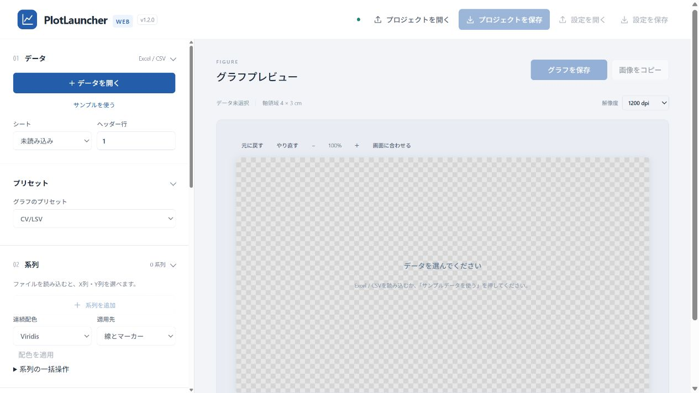
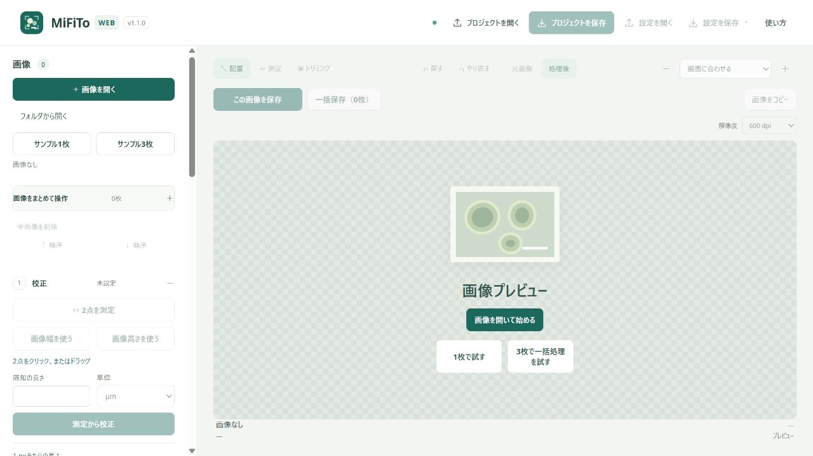
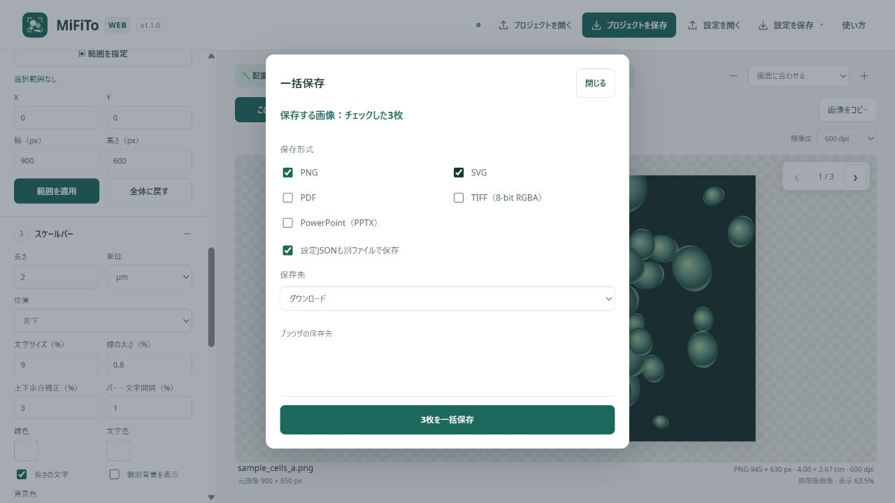
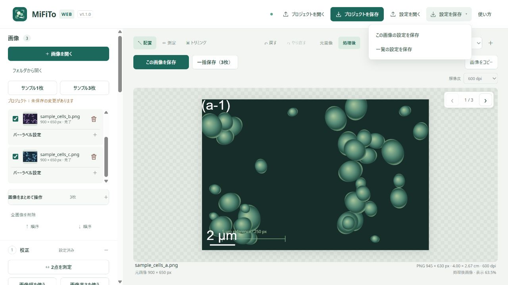

# 図の作成マニュアル ① 共通操作 — 開く・保存・再開

PlotLauncherは測定データからグラフを作るアプリ、MiFiToは顕微鏡画像にスケールバーやラベルを付けるアプリです。このページでは、両方に共通するファイルの扱いを説明します。

**初めて使うときはサンプルで練習しましょう。実験のデータや画像は、次のページで開きます。**

## 1. アプリを開く

PCのブラウザで、使いたいアプリを開きます。

| 作りたい図 | アプリ |
| --- | --- |
| Excel / CSVのデータからグラフを作る | [PlotLauncherを開く](https://murajun620-crypto.github.io/plot_launcher_web/) |
| 顕微鏡画像をトリミングし、スケールバーを付ける | [MiFiToを開く](https://murajun620-crypto.github.io/Microscopy_figure_tools_web/) |

左が設定、右が完成図のプレビューです。設定項目の見出しをクリックすると、開閉できます。項目の説明は、マウスを合わせたときのツールチップにも表示されます。

PlotLauncherは初回に描画機能を読み込みます。準備が終わり、ボタンが押せるようになるまで待ってください。サンプルは、自分でサンプルのボタンを押したときに表示されます。

## 2. 「開く」は用途で選ぶ

| やりたいこと | 押すボタン |
| --- | --- |
| 新しい測定データでグラフを作る | PlotLauncherの「＋ データを開く」 |
| 新しい画像を編集する | MiFiToの「＋ 画像を開く」 |
| 前回の作業をそのまま再開する | 上部の「プロジェクトを開く」 |
| 手元のデータ・画像に、保存しておいた見た目を適用する | データ・画像を開いてから、上部の「設定を開く」 |

**普段の作業は、入力ファイルを開く → 図を整える → 図とプロジェクトを保存する、の順です。**

## 3. 完成した図を保存する

1. 右上の「グラフを保存」または「この画像を保存」を押します。
2. 保存形式にチェックを入れます。初めはPNGで大丈夫です。
3. 保存先を選びます。
4. 保存画面の下にある「保存」を押します。

### 保存形式の使い分け

| 形式 | 主な用途 |
| --- | --- |
| PNG | レポートやスライドに貼り付ける |
| SVG / PDF | 拡大しても線や文字が鮮明な図として扱う |
| PowerPoint（PPTX） | 図を含むPowerPointファイルを作る。保存後にそのファイルを開く |
| TIFF | MiFiToの画像出力。指定された提出形式に合わせて使う |

形式は複数選べます。Web版から、開いているPowerPointへ直接送信する機能はありません。

MiFiToのSVG / PDFでも、元画像部分の画素数は増えません。校正に使った元画像は保持しておきます。

### 保存先の選び方

| 保存先 | 操作 |
| --- | --- |
| 元ファイルと同じフォルダ | 初回にフォルダ選択が出たら、元ファイルが入っているフォルダを選ぶ |
| 指定フォルダ | 「保存先を選ぶ」で出力用のフォルダを選ぶ |
| ダウンロード | ブラウザの保存先へダウンロードする |

ブラウザから元ファイルの親フォルダを自動取得できない場合は、最初に確認が必要です。フォルダを選べないブラウザでは、ダウンロードを使います。保存後はブラウザのダウンロード一覧や、選んだフォルダでファイルを確認しましょう。

## 4. 図をコピーして貼り付ける

1. 右上の「画像をコピー」を押します。
2. コピー完了の表示を確認します。
3. WordやPowerPointなど、貼り付けたい場所で **Ctrl＋V**（Macは **Cmd＋V**）を押します。

コピーされる画像にも、プレビュー右上で選んだ解像度が使われます。ブラウザからクリップボードの許可を求められた場合は、許可してください。コピーできない場合はPNGを保存し、貼り付け先の「画像を挿入」から使います。

## 5. 途中の作業はプロジェクトとして保存する

**後日、同じ状態から編集を続けたいときは「プロジェクトを保存」を使います。** 上部の青・緑のボタンです。

| 保存するもの | 中身 | 再開するとき |
| --- | --- | --- |
| プロジェクト | 元のデータ・画像と編集設定 | 「プロジェクトを開く」で開く |
| 設定JSON | 編集設定。元のデータ・画像は含まない | 元のデータ・画像を先に開き、「設定を開く」で開く |
| PNGなどの完成図 | レポートに使う図 | 図の提出や貼り付けに使う |

PlotLauncherのプロジェクトは **`.plotproject`**、MiFiToは **`.mifito`** です。ファイル名に実験名や日付を入れると探しやすくなります。

例えば、同じ実験のフォルダに次の3点を置きます。

- 元データ・元画像
- 編集を再開するためのプロジェクト
- 提出用の完成図

MiFiToの「設定を保存」には、「この画像の設定を保存」と「一覧の設定を保存」があります。どちらも元画像は含みません。

PNGを保存しただけでは、プロジェクトを保存したことにはなりません。自動保存ではないので、作業を終える前にプロジェクトも保存してください。更新・終了時に未保存の確認が出たら、いったんキャンセルして保存します。

## 6. 解像度とプレビュー倍率を混同しない

| 設定 | 変わるもの |
| --- | --- |
| プレビューの「＋」「−」「画面に合わせる」 | 画面上で見える大きさ |
| 出力する幅・高さ（cm） | レポート上で使う図の寸法 |
| 解像度（dpi） | 同じ寸法の図に使う画素数 |

PlotLauncherの初期値は **1200 dpi**、MiFiToは **600 dpi** です。提出先の指定があれば、そちらに合わせます。dpiを高くするとファイルが大きくなりますが、元の測定データや元画像の情報が増えるわけではありません。

プレビューの灰色のチェック模様は、透明な部分を示します。チェック模様そのものが保存画像に入るわけではありません。

## 次に進む

- [② PlotLauncher — データからグラフを作る](02-plotlauncher.md)
- [③ MiFiTo — 校正・トリミング・一括保存](03-mifito.md)

---

画面：PlotLauncher Web v1.2.0 / MiFiTo Web v1.1.0。2026年10月4日作成。
