# 図の作成マニュアル ② PlotLauncher — データからグラフを作る

測定データを開き、系列・軸・注釈を整えて、レポートに使うグラフを保存します。まずサンプルで、操作の流れを練習しましょう。

[PlotLauncherを開く](https://murajun620-crypto.github.io/plot_launcher_web/) ｜ [① 共通操作](01-common.md)

## 1. サンプルを表示する

1. 左上の「サンプルを使う」を押します。
2. 3本の曲線が表示されるまで待ちます。
3. 左にデータ名・系列、右にグラフが表示されていることを確認します。

サンプルは操作練習用の人工データです。自分の測定結果として使わないでください。

## 2. 自分のデータでは、シート・見出し行・X列・Y列を確認する

1. 「＋ データを開く」でExcelまたはCSVを選びます。
2. Excelでは、使うシートを選びます。
3. 「ヘッダー行」に、列の見出しが書かれた行番号を指定します。
4. 「02 系列」で、横軸に使う **X列** と縦軸に使う **Y列** を選びます。
5. 必要な曲線が足りない場合は「系列を追加」を押し、その系列のX列・Y列を選びます。

例えば、サンプルではX列が `Potential/V`、Y列が `Sample A` です。`Sample B`、`Sample C` も同じX列を使っています。

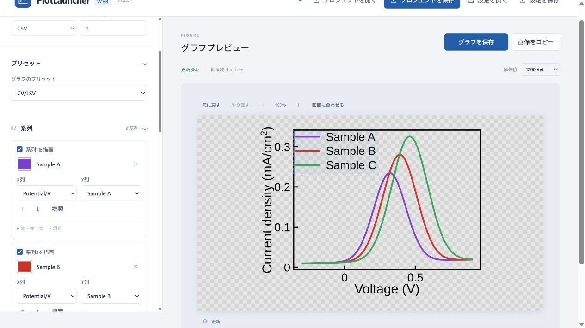

Excelは `.xlsx`・`.xlsm`・`.xls`、CSVは `.csv` を使えます。ファイルは30 MB以内です。右側の「読み込んだデータ」を開くと先頭8行を確認できます。グラフには全行が使われます。Excel側で修正したときは保存し、アプリで読み込み直してください。

## 3. 測定に合うプリセットを選ぶ

左の「グラフのプリセット」から選びます。選択すると、軸表示や描画の設定が切り替わります。**プリセットを変えた後は、X列・Y列、ラベル、単位を確認してください。**

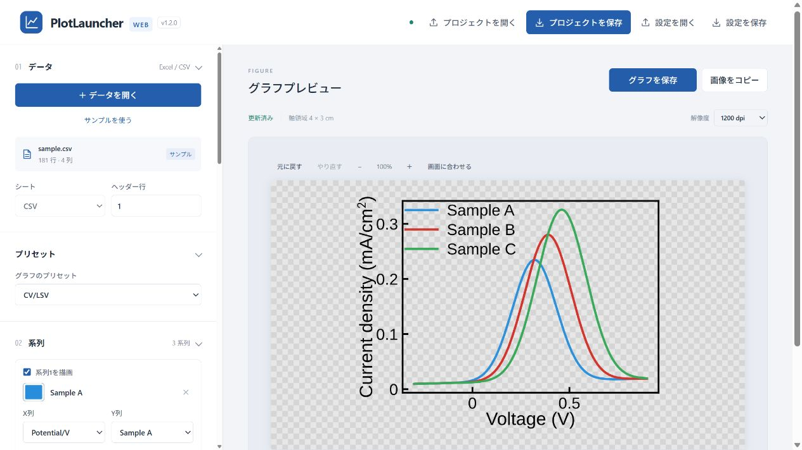

| 用意されているプリセット |
| --- |
| CV/LSV、CA、CP |
| EDX、XPS Survey、XPS Core、XPS Fit、XAFS |
| Raman Spectrum、Raman 3D |
| AFM Section、Roughness |
| ヒストグラム、棒グラフ、一般 |

**操作GIF：CV/LSV → Raman Spectrum → CV/LSV**

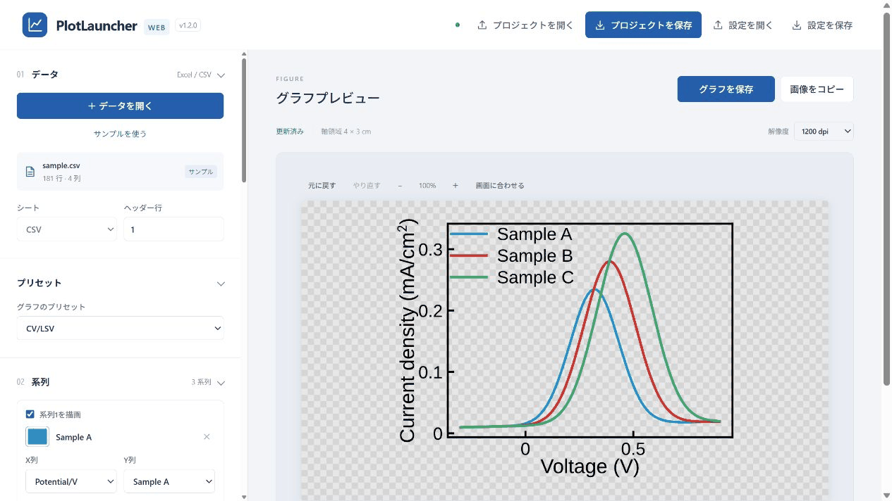

このGIFでは操作を示すため、同じ練習データで切り替えています。実際の図では、測定方法に合うデータと単位を使います。

## 4. 曲線の表示・色・名前を整える

- **一時的に隠す：** 「系列1を描画」などのチェックを外します。もう一度入れると表示されます。
- **色を変える：** 系列名の左にある色の四角を押し、パネルの色を選びます。下のカラーピッカーやカラーコードも使えます。
- **凡例の名前を変える：** `Sample A` などの系列名を入力し直します。
- **線やマーカーを変える：** その系列の「線・マーカー・誤差」を開きます。

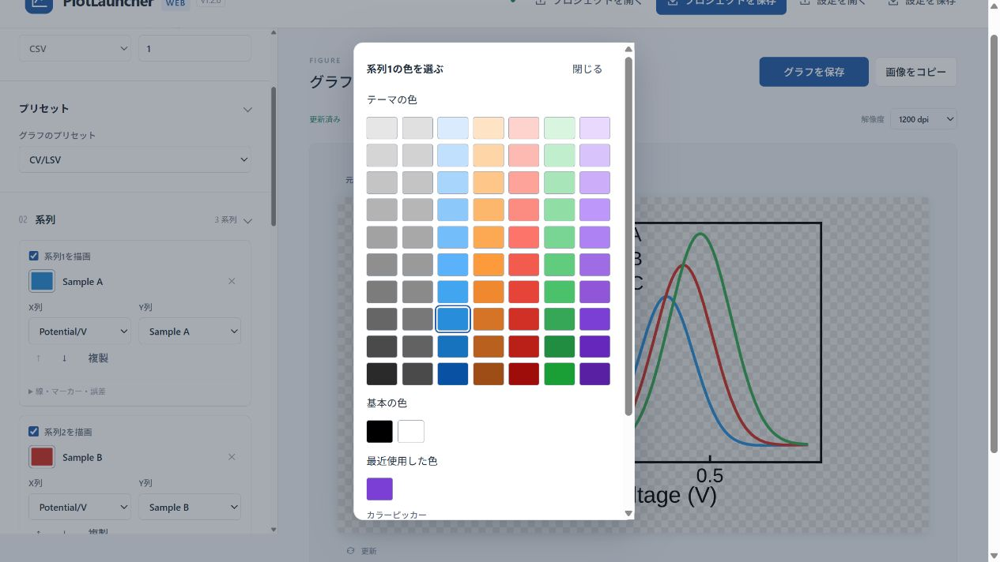

**操作GIF：系列1を隠す → 再表示する → 色を紫に変える**

グラフの線やプロットをダブルクリックしても、その系列の設定を開けます。狙いにくいときは、左の系列一覧で同じ設定を変更できます。

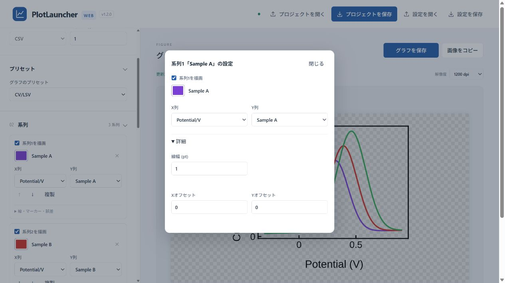

## 5. 軸ラベル・目盛り・サイズを整える

### 軸ラベルを直接編集する

1. プレビューの軸ラベルをダブルクリックします。
2. ラベルや単位を変更します。
3. 「閉じる」を押し、表示を確認します。

軸ラベルはドラッグでも移動できます。移動しすぎたときは、編集画面の「標準位置に戻す」を押します。

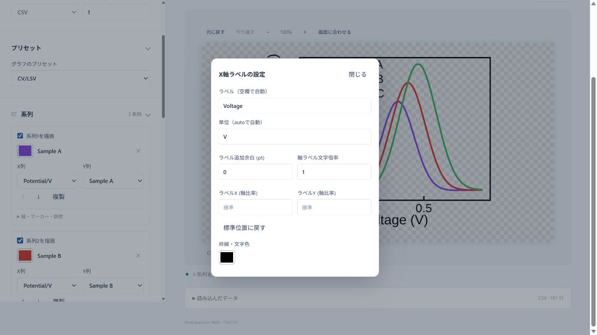

**操作GIF：X軸ラベルを「Potential」に変更し、位置をドラッグで調整する**

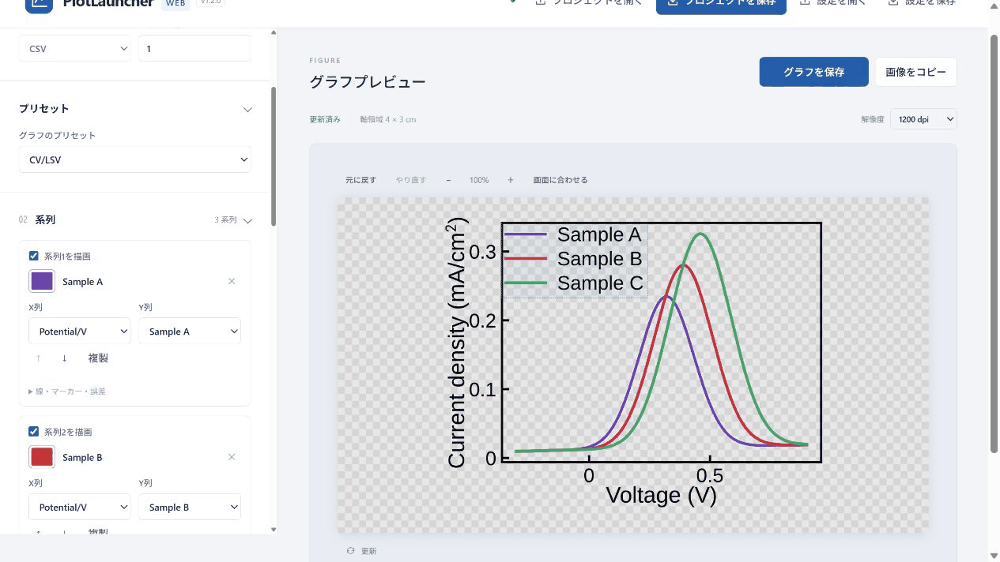

### 目盛りの範囲・間隔を変える

プレビューの軸の数値をダブルクリックします。「範囲を自動設定」「目盛り間隔を自動設定」のチェックを外すと、数値を指定できます。自動に戻したいときはチェックを入れます。

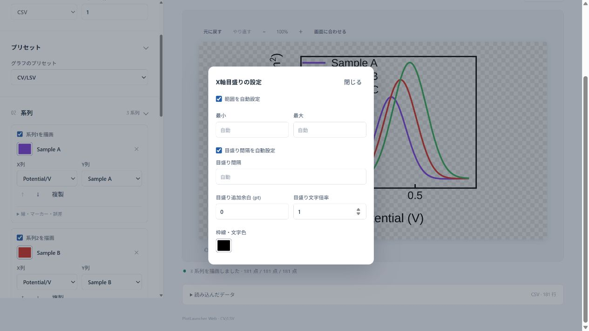

左右の軸を取り違えないよう、設定画面の「X軸」「Y軸」の見出しを確認します。数値にマウスを合わせると、その軸の目盛り全体がハイライトされます。

### 図の寸法を決める

左の「03 軸とサイズ」で「軸領域の幅」「軸領域の高さ」をcmで指定します。この寸法はグラフの枠内です。保存した図には、軸ラベルなどの周囲の余白も加わります。

画面で細かい位置を確認するときは、プレビューの「＋」「−」や **Ctrl＋ホイール**（Macは **Cmd＋ホイール**）を使います。「画面に合わせる」で表示倍率を戻せます。表示倍率を変えても、保存する図の寸法は変わりません。

## 6. 注釈と凡例を整える

1. 左の「注釈」で「テキストを追加」「線を追加」「矢印を追加」のいずれかを押します。
2. テキストの場合は、一覧の「文字」に内容を入力します。
3. プレビューで注釈をドラッグして位置を調整します。

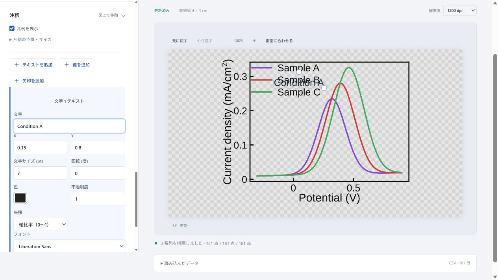

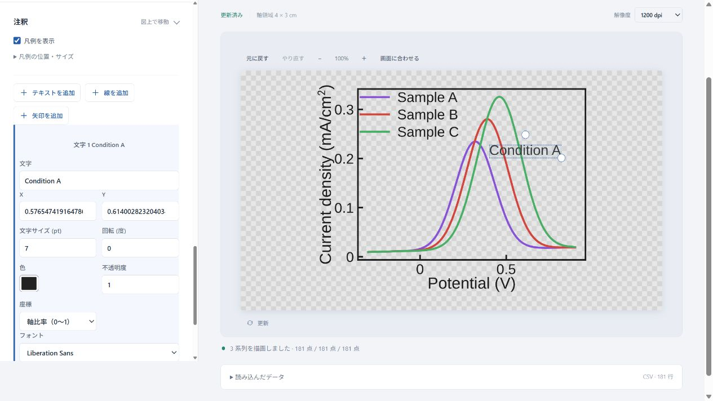

**消すときは、図上または一覧で注釈を選び、「選択を削除」を押します。** 図上で選択した後のDeleteキーでも削除できます。間違えたときは、プレビューの「元に戻す」を押します。

**操作GIF：文字を追加 → 入力 → 移動 → 削除 → 元に戻す**

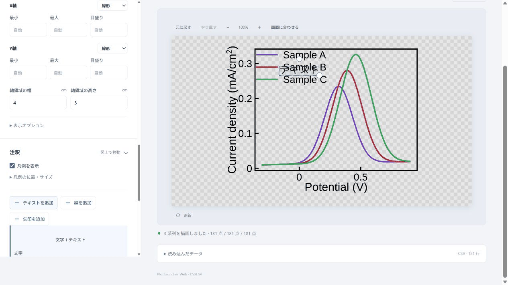

凡例は「注釈」の **「凡例を表示」** でオン・オフを切り替えます。凡例もプレビュー上でドラッグして移動できます。注釈が選びにくい場合は、左の一覧から選んでください。

## 7. 背景を決める

枠内の空いている部分をダブルクリックすると「枠内の背景の設定」、枠外の余白をダブルクリックすると「図全体の背景の設定」が開きます。それぞれの「背景色を使用」で塗りつぶしを切り替えます。

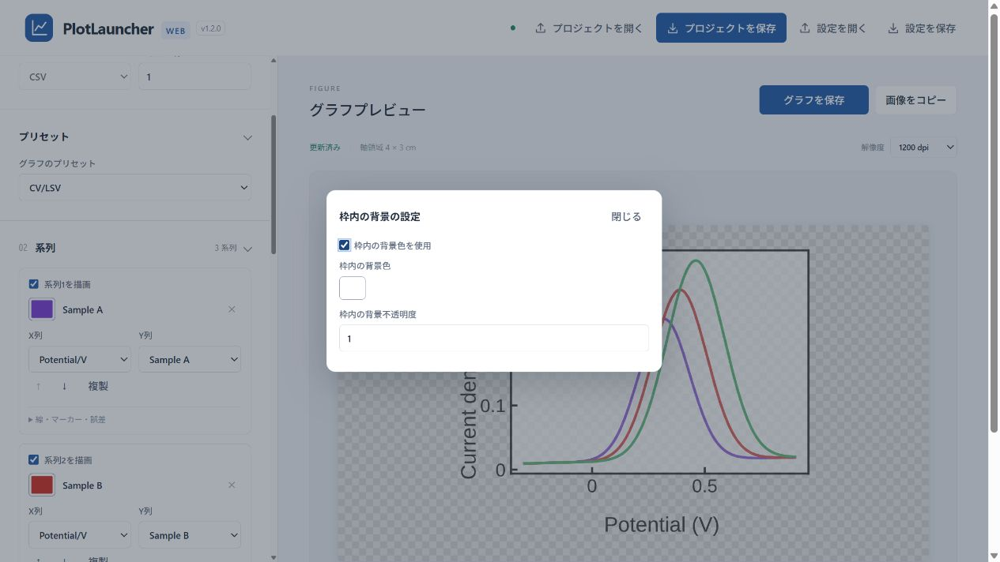

灰色のチェック模様は透明部分の表示です。貼り付け先で白い背景が必要なら、背景色を有効にして白を選びます。

## 8. 保存して、レポートで使う

1. 曲線・系列名・軸の単位・注釈が正しいか確認します。
2. 右上の「グラフを保存」を押します。
3. ファイル名、保存形式、保存先を選び、「保存」を押します。
4. 後で修正するため、上部の「プロジェクトを保存」も押します。

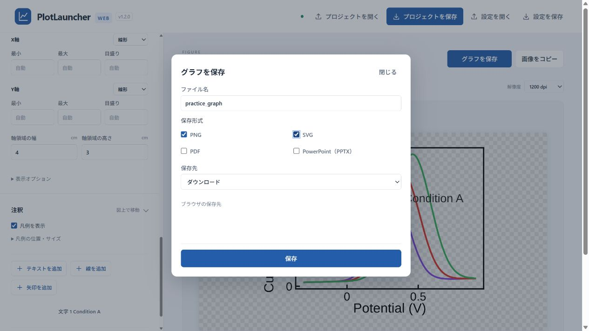

貼り付けるだけなら「画像をコピー」も使えます。保存とコピー、プロジェクトの再開については [① 共通操作](01-common.md) を参照してください。

## うまく表示されないとき

| 症状 | 確認すること |
| --- | --- |
| 欲しい曲線が出ない | X列・Y列と「系列を描画」のチェック |
| 列名がおかしい | シートとヘッダー行 |
| 変更前の図が表示されている | 「更新済み」になるまで待つ。必要なら「更新」を押す |
| 軸ラベルの内容・単位がおかしい | プリセット、軸ラベル、単位を確認 |
| 注釈を消せない | 図上か左の一覧で注釈を選択してから削除 |
| 図が大きすぎて見えない | プレビューの「画面に合わせる」 |
| レポートに貼ると見た目が違う | 透明背景かどうか、貼り付け先での拡大率を確認 |

## 練習のゴール

- [ ] サンプルを表示できた
- [ ] 系列1を隠し、再表示できた
- [ ] 曲線の色を変えられた
- [ ] 軸ラベルをダブルクリックして編集できた
- [ ] 注釈を追加・移動・削除できた
- [ ] 完成図とプロジェクトを保存できた

---

画面：PlotLauncher Web v1.2.0。2026年10月4日作成。
