# 図の作成マニュアル ③ MiFiTo — 校正・トリミング・一括保存

顕微鏡画像を開き、長さを校正して、スケールバーとパネルラベルを付けます。まずサンプル3枚で練習し、最後にまとめて保存しましょう。

[MiFiToを開く](https://murajun620-crypto.github.io/Microscopy_figure_tools_web/) ｜ [① 共通操作](01-common.md)

## 1. サンプル3枚を開く

1. 左上の「サンプル3枚」を押します。
2. 左に画像一覧、右に最初の画像が表示されることを確認します。
3. 一覧のファイル名、またはプレビュー右上の「‹」「›」で画像を切り替えます。

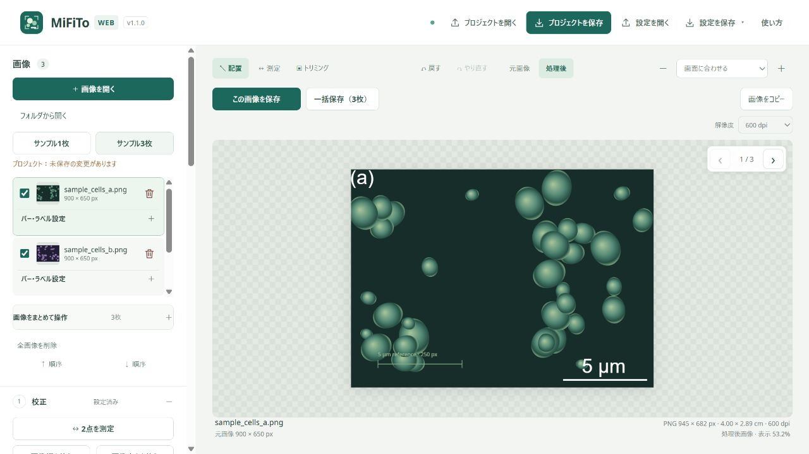

自分の画像では「＋ 画像を開く」を使います。複数のファイルを同時に選べます。画像をプレビューへドラッグ＆ドロップして開くこともできます。PNG・JPEG・BMP・SVG・TIFFに対応しています。

サンプルは練習用の模式画像で、初めから校正されています。次の練習では一度校正をリセットし、設定し直します。

## 2. 既知の長さを測って校正する

**校正とは、画像の1 pxが実際の何µmなどに相当するかを決めることです。正しいスケールバーを付けるため、最初に行います。**

### サンプルでの練習

1. 「1 校正」で「校正をリセット」を押します。追加された大きなスケールバーが消えます。
2. 「↔ 2点を測定」またはプレビュー上部の「↔ 測定」を押します。
3. 画像左下の薄い線の両端をクリックします。この線には `5 µm reference · 250 px` と書かれています。端から端までドラッグしても測れます。
4. 「既知の長さ」を **5**、単位を **µm** にします。
5. 「測定から校正」を押します。
6. `1 px = 約0.02 µm` になり、大きなスケールバーが再表示されることを確認します。

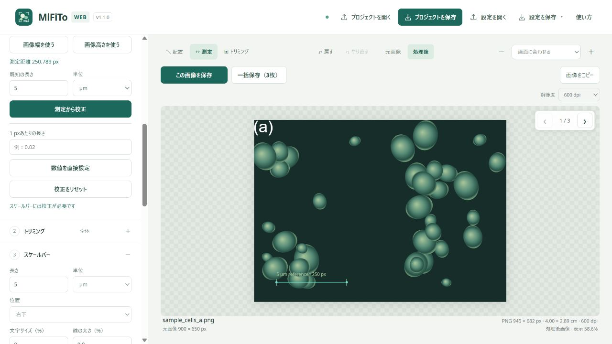

**操作GIF：校正をリセット → 基準線の両端を測る → 5 µmとして校正する**

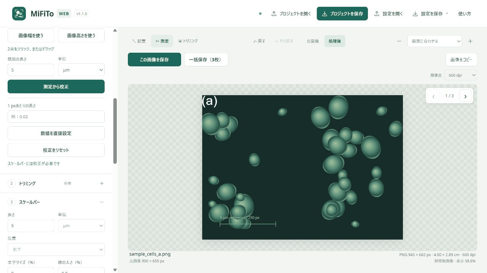

マウスで端を選ぶため、練習では約0.02 µmになれば大丈夫です。基準線を大きく表示して測ると、端を選びやすくなります。2点の選択をやり直すときはEscapeを押してから、測定し直します。

### 自分の画像では、確認できる値を使う

| 分かっている情報 | 使う操作 |
| --- | --- |
| 画像内の基準線などの実際の長さ | その両端を測定し、「既知の長さ」と単位を入力する |
| 画像全体の実際の幅・高さ | 「画像幅を使う」「画像高さを使う」で測定し、実際の長さを入力する |
| 撮影情報から分かる、1 pxあたりの実際の長さ | 「1 pxあたりの長さ」を入力し、「数値を直接設定」を押す |

**分からない長さを推測して入力しないでください。** 撮影装置の記録や元画像の基準線を確認します。倍率が違う画像を扱う場合は、画像を切り替えて、一枚ずつ校正値を確認します。

## 3. 必要な範囲にトリミングする

「2 トリミング」の見出しを押して開きます。ここでは、幅を保ったまま3：2にそろえます。

1. 「縦横比」で **3：2** を選びます。
2. 「適用方法」で **画像幅を使う（幅を維持）** を選びます。
3. プレビューの枠で、残す範囲を確認します。
4. 「範囲を適用」を押します。

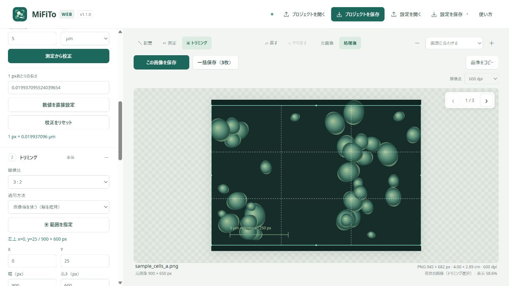

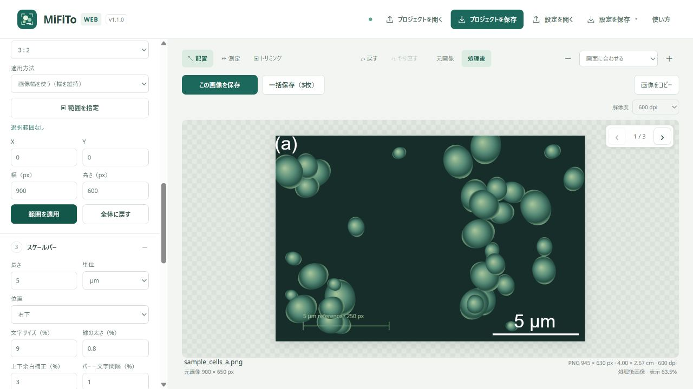

**操作GIF：3：2の範囲を指定し、トリミングを適用する**

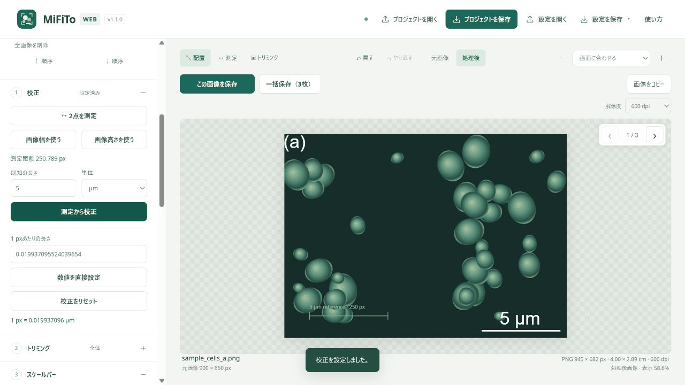

自由に切り抜く場合は「自由」と「範囲指定した部分」を選び、「▣ 範囲を指定」でプレビューをドラッグします。失敗したら「全体に戻す」を押します。「元画像」と「処理後」のボタンで見比べられます。

**トリミング範囲は、読み込んでいる他の画像にも反映されます。** 画像を切り替えて、必要な部分が残っているか確認してください。元の画像ファイルそのものは切り抜かれません。

## 4. スケールバーの見た目を整える

「3 スケールバー」で、長さ・単位・位置・文字サイズなどを変更します。

練習では「長さ」を **2 µm**、「位置」を **左下** にしてみましょう。数値を入力したら、Tabキーや別の項目をクリックして入力を確定します。

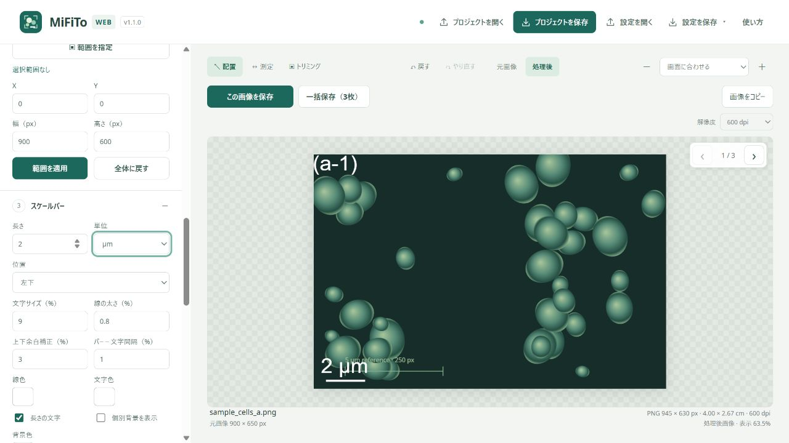

- 暗い画像では白、明るい画像では黒など、読み取れる色を選びます。
- 画像に重なる場合は「画像外・下中央」などの位置も選べます。
- 色の四角を押すと、色パネルとカラーピッカーが開きます。
- 「個別背景を表示」で、バーの周囲だけに背景を付けられます。

バーの長さや見た目は他の画像にも反映されます。校正値は画像ごとに保持されるため、同じ2 µmでも、画像によって線の画素数は異なります。

サンプル左下の薄い基準線は、元画像に描かれた線です。アプリで追加した大きなスケールバーとは別です。

## 5. パネルラベルを付ける

複数の画像を並べた図には、`(a)`、`(b)`などのラベルを付けます。

1. 「4 パネルラベル」の「パネルラベルの種別」で形式を選びます。
2. 「連番の例」で、意図した並びか確認します。
3. **「ラベルを適用」** を押します。選んだだけでは、各画像のラベルは変わりません。
4. 画像を切り替えて、実際のラベルを確認します。

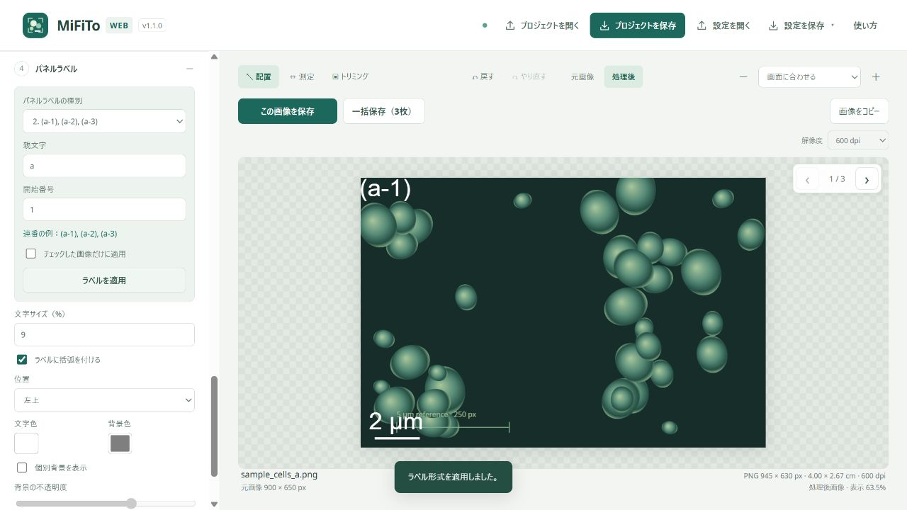

**操作GIF：(a), (b), (c) → (a-1), (a-2), (a-3)に変更し、次の画像を確認する**

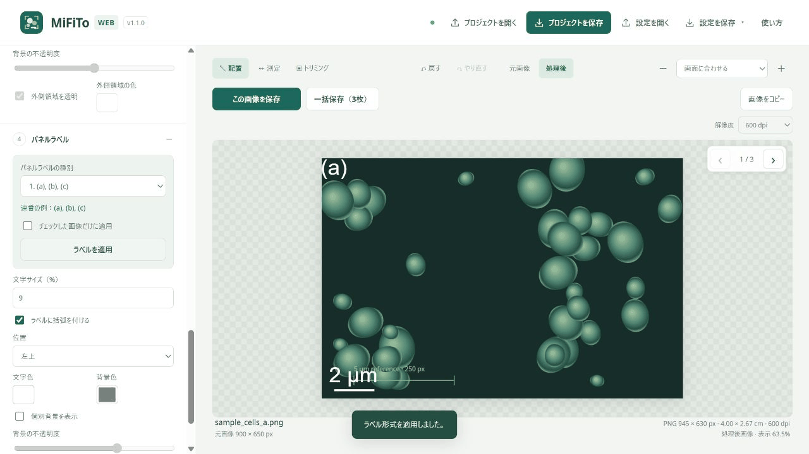

ラベルやバーは、プレビュー上部の「↖ 配置」を選び、ドラッグして位置を調整できます。特定の画像だけ表示を消す場合や文字を変更する場合は、左の画像一覧の **「バー・ラベル設定」** を開きます。

## 6. 保存する画像をチェックして、一括保存する

**画像名の左のチェックは、一括保存する対象です。表示中の画像を選ぶ操作とは別です。**

1. 保存したい画像にチェックを入れます。
2. プレビューで各画像の校正、トリミング、バー、ラベルを確認します。
3. 右上の「一括保存（○枚）」を押します。
4. 保存形式と保存先を選びます。
5. 保存画面の下の「○枚を一括保存」を押します。

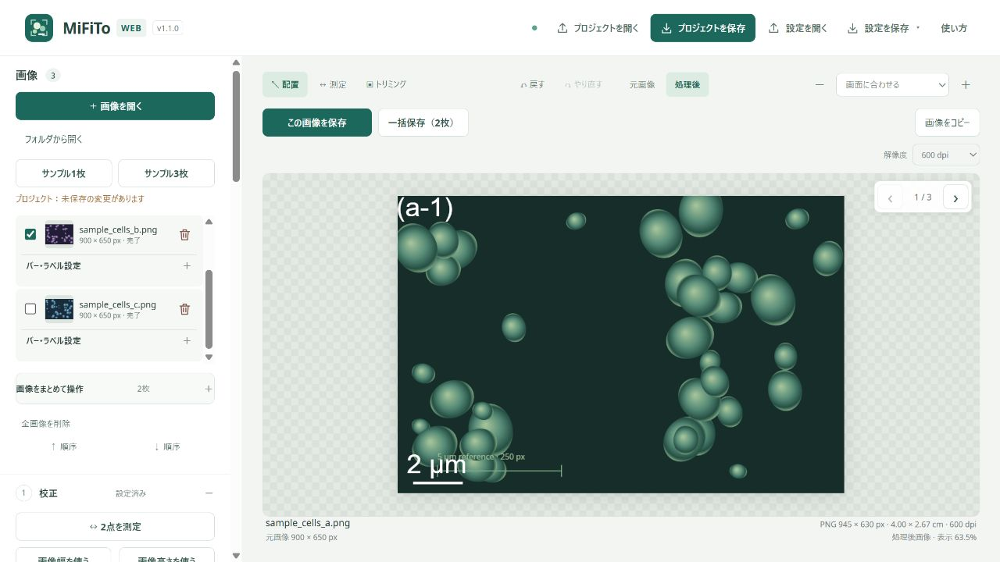

**操作GIF：一括保存を開き、保存形式を確認して3枚を保存する**

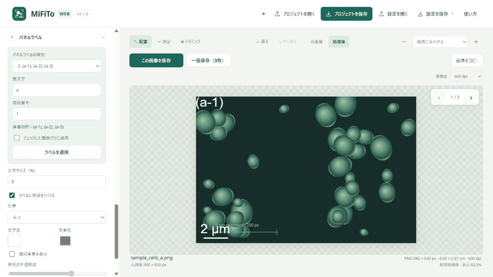

「設定JSONも別ファイルで保存」にチェックが入っていると、画像ごとの設定ファイルも生成されます。GIFの例は、3枚についてPNG・SVG・設定JSONを保存し、計9ファイルをダウンロードしています。ブラウザに複数ファイルのダウンロード確認が出たら、許可してください。

出力画像の名前には `_mifito` が付くため、元画像とは区別できます。図を保存した後は、上部の「プロジェクトを保存」も押します。元画像と編集状態がまとめて保存され、次回は「プロジェクトを開く」で再開できます。

1枚だけ保存する場合は、保存したい画像を表示して「この画像を保存」を押します。「画像をコピー」で、その画像をWordやPowerPointへ貼り付けることもできます。保存先と解像度については [① 共通操作](01-common.md) を参照してください。

## うまくいかないとき

| 症状 | 確認すること |
| --- | --- |
| スケールバーが出ない | 校正済みか、画像一覧のバー表示がオンか |
| バーの長さがおかしい | 既知の長さ、単位、画像ごとの校正値 |
| ラベル形式を選んでも変わらない | 「ラベルを適用」を押したか |
| 一括保存の枚数がおかしい | 画像名の左のチェック |
| ほかの画像も切り抜かれた | トリミングは共通反映。必要なら「全体に戻す」 |
| ラベルやバーが動かせない | 「↖ 配置」を選んでいるか |
| TIFFを開いたときの見え方が違う | 読み込み時に先頭ページを表示用の8 bitへ変換するため、元のTIFFも保持する |

## 練習のゴール

- [ ] サンプル3枚を表示し、画像を切り替えられた
- [ ] 基準線の両端を測り、約0.02 µm/pxとして校正できた
- [ ] 3：2にトリミングできた
- [ ] 2 µmのバーを左下に配置できた
- [ ] パネルラベルを一括適用できた
- [ ] 対象画像を選び、図とプロジェクトを保存できた

---

画面：MiFiTo Web v1.1.0。2026年10月4日作成。
