# PlotLauncher 詳細マニュアル

測定データの準備から、系列・軸・注釈の調整、完成図の保存、プロジェクトの再開までを説明します。

[PlotLauncherを開く](https://murajun620-crypto.github.io/plot_launcher_web/) ｜ [最初の操作だけを見る](quick.md)

## 1. 画面とファイルを開く操作

PCのブラウザでアプリを開き、描画機能の準備が終わるまで待ちます。左が設定、右がプレビューです。左の各見出しはクリックで開閉できます。

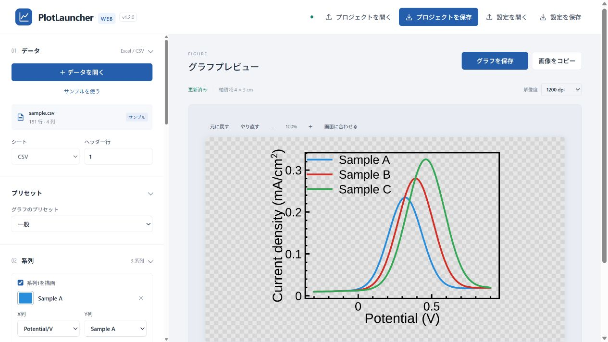

| やりたいこと | 操作 |
| --- | --- |
| 新しい測定データで図を作る | 「＋ データを開く」でExcel / CSVを選ぶ |
| 操作を練習する | 「サンプルを使う」を押す |
| 前回の編集を再開する | 上部の「プロジェクトを開く」で `.plotproject` を選ぶ |
| 別のデータに保存済みの見た目を適用する | データを開いた後、「設定を開く」で設定JSONを選ぶ |

Excelは `.xlsx`・`.xlsm`・`.xls`、CSVは `.csv` に対応しています。ファイルは30 MB以内、表は20万行・256列以内です。サンプルは練習用の人工データです。

## 2. データの構成

### 基本は列に項目、行に測定点

一つの表に、見出し行と、その下の測定値を並べます。XとYを横に並べ、**同じ行のXとYを一つの測定点** として扱います。

- 見出しは `Potential/V`・`Sample A` など、区別できる名前にします。
- 数値のセルは `0.25` のように数値だけにします。`0.25 V`・`未測定` などの文字は、そのままでは数値として描画されません。
- 単位は見出しや軸設定に記入します。
- 表の途中に説明文・合計行・別の表を入れないようにします。セルの結合も避けます。
- Excelの列幅やセルの色は、グラフの線の色や図の寸法には引き継がれません。

### A. 複数の系列でXが共通の場合

最初の列をX、その右に各系列のYを並べます。

| 行 | A列：Potential/V | B列：Sample A | C列：Sample B |
| --- | --- | --- | --- |
| 1 | **Potential/V** | **Sample A** | **Sample B** |
| 2 | -0.50 | 0.001 | 0.003 |
| 3 | -0.25 | 0.050 | 0.080 |
| 4 | 0.00 | 0.200 | 0.250 |
| 5 | 0.25 | 0.120 | 0.180 |

この表では、ヘッダー行を **1** に指定し、次のように系列を作ります。

| 系列 | X列 | Y列 |
| --- | --- | --- |
| Sample A | Potential/V（A列） | Sample A（B列） |
| Sample B | Potential/V（A列） | Sample B（C列） |

「02 系列」→「系列の一括操作」→ **「共通X・全Y」** を押すと、最初の列を共通Xとして、右側の列をそれぞれYに設定できます。追加した系列の列と名前を確認してください。

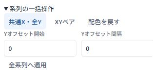

[この並びを練習するCSV](examples/shared_x.csv) をダウンロードして、「＋ データを開く」から開けます。ファイルの数値は人工データです。

### B. 系列ごとにXが違う場合

`X1, Y1, X2, Y2` の順に、XとYを組にして並べます。

| 行 | A列 | B列 | C列 | D列 |
| --- | --- | --- | --- | --- |
| 1 | **Potential A/V** | **Current A** | **Potential B/V** | **Current B** |
| 2 | -0.50 | 0.001 | -0.45 | 0.003 |
| 3 | -0.25 | 0.050 | -0.20 | 0.080 |
| 4 | 0.00 | 0.200 | 0.05 | 0.250 |

| 系列 | X列 | Y列 |
| --- | --- | --- |
| Current A | Potential A/V（A列） | Current A（B列） |
| Current B | Potential B/V（C列） | Current B（D列） |

「系列の一括操作」→ **「XYペア」** を使います。系列ごとに点数が違う場合は、短い系列の末尾を空欄にします。各系列のX・Yの対応を崩さないでください。

[X・Yの組を練習するCSV](examples/xy_pairs.csv)

### C. 見出しが1行目ではない場合

測定装置の情報などが先頭にあるときは、**列名が並んでいる行の番号** を「ヘッダー行」に入力します。

| 行 | A列 | B列 | C列 |
| --- | --- | --- | --- |
| 1 | Practice data | Artificial values | |
| 2 | Header is row 3 | | |
| 3 | **Potential/V** | **Sample A** | **Sample B** |
| 4 | -0.50 | 0.001 | 0.003 |
| 5 | -0.25 | 0.050 | 0.080 |

この場合は **ヘッダー行＝3** です。1のままだと、説明文が列名になり、正しい列を選べません。

[ヘッダー行3を練習するCSV](examples/header_row_3.csv)

見出しがない表は、先頭に見出しを追加して保存すると扱いやすくなります。Excelに複数のシートがある場合は、表の入ったシートも選びます。CSVはコンマ区切りで保存します。通常はExcelの「CSV UTF-8」を選ぶと扱いやすくなります。

### D. 読み込んだ表を確認する

プレビュー下の **「読み込んだデータ」** を開きます。表示されるのは先頭8行ですが、グラフには全行を使います。

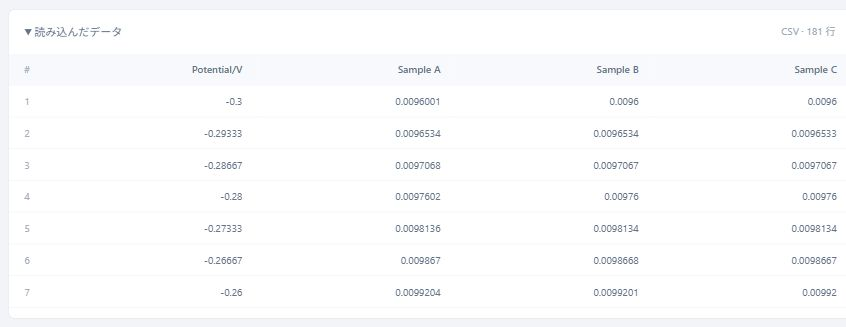

列名がおかしい場合は、シート・ヘッダー行・元ファイルを確認します。空欄の見出しは「列 1」などの名前になり、同名の列は番号が付くことがあります。元の表で名前を付けておくと選びやすくなります。Excelで修正した後は保存し、アプリで開き直します。

通常の数値グラフでは、XまたはYが空欄・数値でない行は、その系列の描画から除かれます。「描画データの確認」が出たら内容を確認し、欠損がある場合は元のデータも点検してください。棒グラフのカテゴリ名は、下の専用プリセットの説明を参照してください。

線は表の行の順につながります。**CVの往復掃引など、測定順に意味があるデータを、電位の昇順だけで並べ替えないでください。**

### E. 誤差や専用プリセットで使う列

| 作る図 | 表と設定の考え方 |
| --- | --- |
| 誤差付きの一般グラフ | X・Yのほかに誤差の列を用意し、系列の「線・マーカー・誤差」で指定する |
| 対称なY誤差 | ±の大きさを別の列に入れ、「Y誤差（±）の列」に指定する |
| 下限・上限を別に指定するY誤差 | 下限値・上限値の列を用意し、「Y誤差最小値」「Y誤差最大値」に指定する。±の幅とは区別する |
| Raman Spectrum・Raman 3D | 共通の波数X列と、各スペクトルの強度Y列を並べる。Raman 3Dでは各系列の正規化設定も確認する |
| 棒グラフ | カテゴリ名または数値のX列と、数値のY列を用意する |
| 粒径ヒストグラム | No列＋粒径列のように少なくとも2列を用意し、粒径の実測値の列を選ぶ。集計済みの頻度表と区別する |
| XPS Fit | 専用の書き出し形式を保つ。成分Yと背景Yの列を確認する。Abscissa・Ordinateで始まる見出しを含むCSVは自動判定される |

誤差の列などを含む表では、「共通X・全Y」で不要な列まで曲線にしないようにします。必要な系列だけを手動で追加し、X・Y・誤差の列をそれぞれ指定できます。

## 3. プリセットを選ぶ

「グラフのプリセット」から測定に合うものを選びます。プリセットを変えると軸の表示や描画設定が変わるので、**X列・Y列、ラベル、単位を再確認** します。

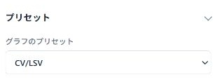

| 分類 | プリセット |
| --- | --- |
| 電気化学 | CV/LSV、CA、CP |
| 分光など | EDX、XPS Survey、XPS Core、XPS Fit、XAFS |
| Raman | Raman Spectrum、Raman 3D |
| 表面形状 | AFM Section、Roughness |
| その他 | ヒストグラム、棒グラフ、一般 |

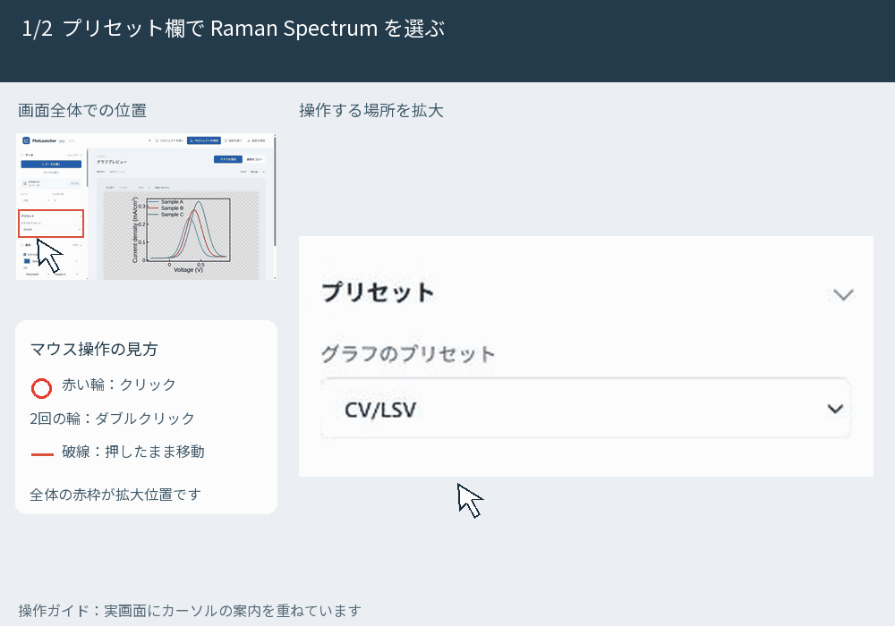

このGIFは操作練習のため同じ人工データで切り替えています。実際の図には、測定方法に合うデータと単位を使ってください。Roughnessでは対数軸の初期設定、Raman 3Dでは正規化、ヒストグラムでは粒径列など、プリセット独自の設定も確認します。

## 4. 系列の表示と見た目

「系列を描画」のチェックで一時的に隠せます。再びチェックすると表示されます。系列は最大32個です。X列・Y列・凡例に使う名前を、系列ごとに確認します。

色の四角を押すと、色パネルが開きます。パネルの色、カラーピッカー、カラーコードから選べます。

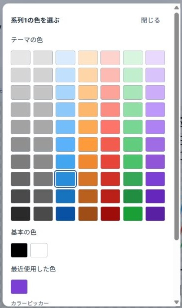

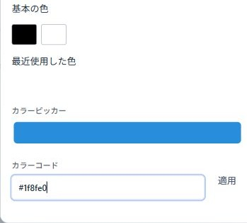

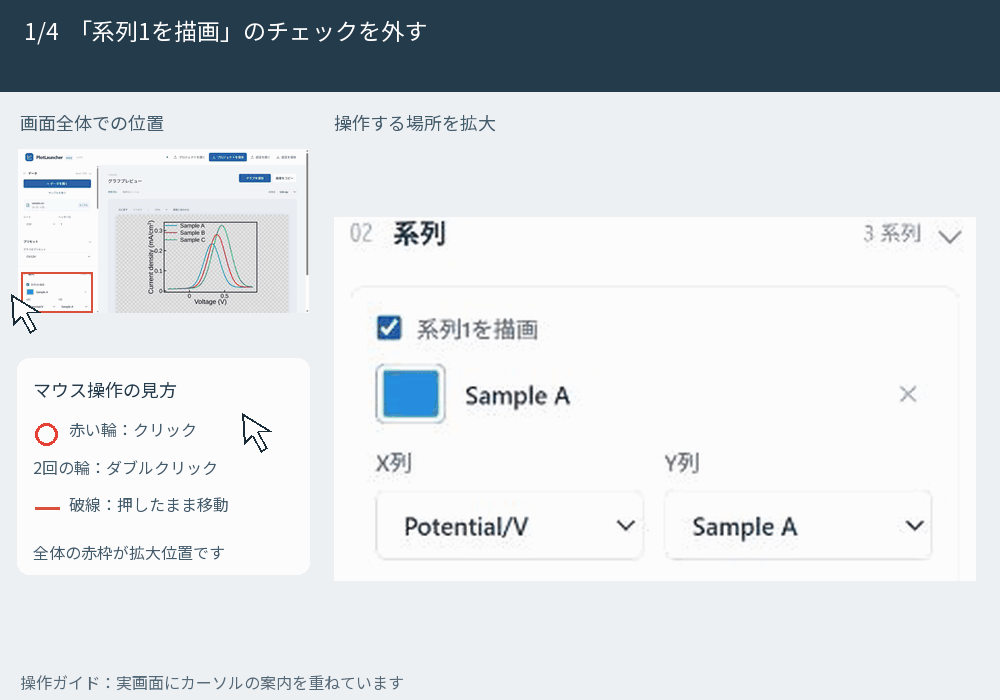

「線・マーカー・誤差」を開くと、線や点の描き方、太さ、誤差の列などを設定できます。プレビューの線やプロットをダブルクリックしても、その系列の設定が開きます。

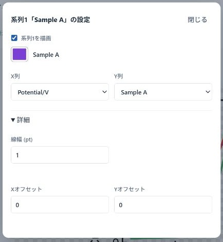

Yオフセットで系列を上下にずらす場合は、「系列の一括操作」の開始値・間隔を設定します。比較図では、位置をずらしたことが読み手に分かるように記載してください。

## 5. 軸ラベルと目盛り

軸ラベルをダブルクリックすると、ラベル・単位・位置などの設定が開きます。変更して「閉じる」を押します。ラベルはドラッグで動かせます。戻したいときは **「標準位置に戻す」** を使います。

軸の数値をダブルクリックすると、範囲・目盛り間隔の設定が開きます。「範囲を自動設定」「目盛り間隔を自動設定」のチェックを外すと、値を指定できます。自動に戻すときはチェックを入れます。

数値にマウスを合わせると、その軸の目盛り全体がハイライトされます。設定画面の「X軸」「Y軸」を確認してください。対数軸には正の値を使います。

## 6. 図の寸法と表示倍率

「03 軸とサイズ」の幅・高さは、**グラフの枠内の寸法（cm）** です。保存した図には、ラベルなどの周囲の余白も加わります。

| 操作 | 変わるもの |
| --- | --- |
| 幅・高さ（cm） | 保存する図の軸領域の寸法 |
| 解像度（dpi） | PNG保存・画像コピーの画素数 |
| ＋・−・Ctrl＋ホイール（MacはCmd＋ホイール） | 画面で見る大きさ |
| 「画面に合わせる」 | プレビューの表示倍率を戻す |

初期の解像度は1200 dpiです。提出先の指定があれば合わせます。表示倍率を変えても、保存する図の寸法は変わりません。高いdpiはファイルが大きくなりますが、測定点は増えません。

## 7. 注釈と凡例

「注釈」の **「テキストを追加」「線を追加」「矢印を追加」** を押すと追加されます。テキストは一覧の「文字」に入力し、図上でドラッグして位置を整えます。

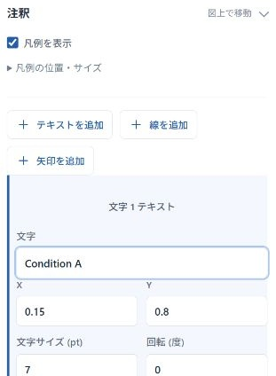

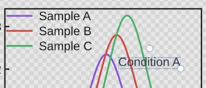

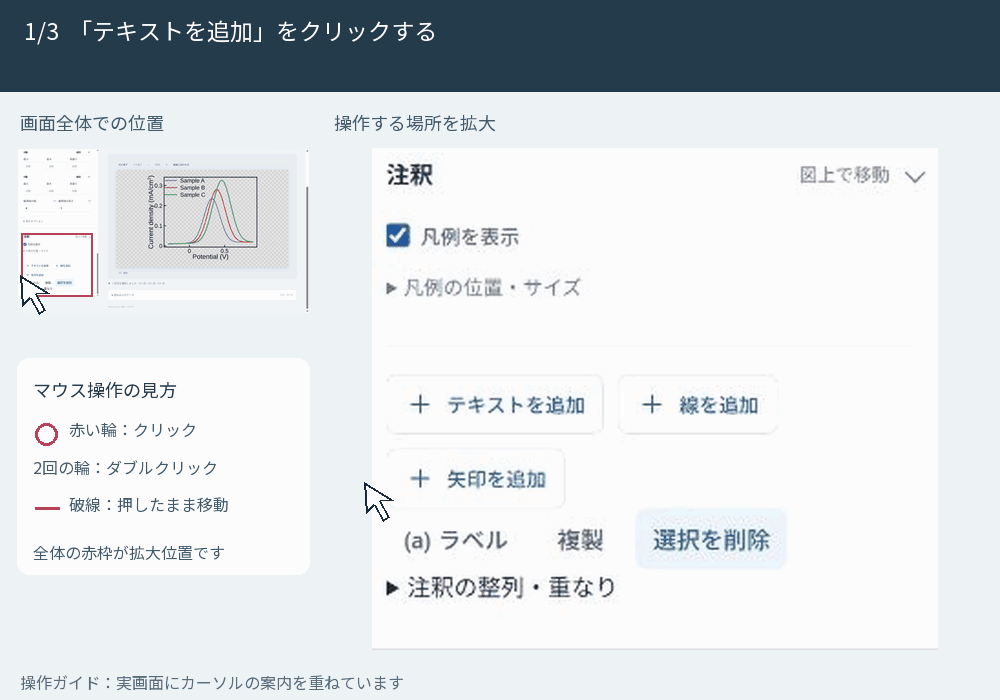

消すときは、図上または一覧で選び、**「選択を削除」** を押します。図上で選択した後のDeleteキーでも削除できます。間違えたときは「元に戻す」を使います。図上で狙いにくいときは左の一覧から選んでください。

凡例は「凡例を表示」のチェックで切り替えます。図上でドラッグして移動できます。「凡例の位置・サイズ」からも調整できます。

## 8. 背景と透明部分

図全体の余白と、グラフの枠内の背景は別々に設定できます。枠内の空いている場所、または枠外の余白をダブルクリックして設定を開き、「背景色を使用」で切り替えます。

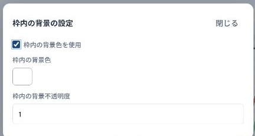

灰色のチェッカーボードは透明部分を示します。模様そのものが保存画像に入ることはありません。貼り付け先で白を使いたいときは背景色を有効にして白を選びます。

## 9. 完成図を保存する

「グラフを保存」で、ファイル名・形式・保存先を選び、下の「保存」を押します。形式は複数選べます。

| 形式 | 使い方 |
| --- | --- |
| PNG | レポートやスライドへの貼り付け |
| SVG・PDF | 拡大しても線や文字が鮮明な図 |
| PowerPoint（PPTX） | 図を含む新しいPowerPointファイルとして保存し、保存後に開く |

| 保存先 | 初回の操作 |
| --- | --- |
| 元ファイルと同じフォルダ | フォルダ選択が出たら、元データの入ったフォルダを選ぶ |
| 指定フォルダ | 「保存先を選ぶ」で出力先を選ぶ |
| ダウンロード | ブラウザの保存先へ保存する |

ブラウザから元ファイルの親フォルダを取得できない場合は、最初に確認が必要です。フォルダ選択に対応しないブラウザではダウンロードを使います。保存後は、選んだフォルダやブラウザのダウンロード一覧で確認します。

## 10. 画像をコピーする

「画像をコピー」を押し、コピー完了を確認して、Word・PowerPointなどで **Ctrl＋V**（Macは **Cmd＋V**）を押します。右上の解像度がコピーにも使われます。クリップボードの許可を求められたら許可します。使えない場合はPNGを保存して挿入します。

開いているPowerPointへの直接送信は行いません。PPTXを保存するか、画像コピーを使います。

## 11. プロジェクトと設定を保存して再開する

| 保存するもの | 中身 | 開き直す操作 |
| --- | --- | --- |
| `.plotproject` | 元データ、編集設定、読み込んだフォントなど | 「プロジェクトを開く」 |
| 設定JSON | 図の設定。元データは含まない | 元データを開いてから「設定を開く」 |
| PNGなど | 完成図 | 提出や貼り付けに使う |

後で編集するためには **「プロジェクトを保存」** を押します。プロジェクトは自動保存ではありません。更新や終了時に未保存の確認が出たら、キャンセルして保存します。完成図の保存や画像コピーだけでは、プロジェクト保存済みにはなりません。

フォントを変更する場合は、表示オプションからフォントを選ぶか、手元のフォントファイルを読み込みます。図に使うフォントをそろえ、保存した図でも表示を確認します。

## 12. うまく表示されないとき

| 症状 | 確認すること |
| --- | --- |
| 列名が説明文になった | シートとヘッダー行 |
| 一部の点や曲線がない | X・Y列の空欄や文字、系列の描画チェック |
| 同じ列が何本も描かれた | 共通XとXYペアの使い分け、系列ごとの列 |
| 余分な誤差の曲線ができた | 一括選択で誤差列もYにした可能性。不要な系列を削除する |
| ラベルや単位が違う | プリセットと軸ラベルの設定 |
| 変更前の図が表示される | 「更新済み」になるまで待ち、必要なら「更新」を押す |
| 注釈が消せない | 図上か左の一覧で選択してから削除 |
| 図が大きすぎる | 「画面に合わせる」 |
| 貼り付け先で背景が変わる | 背景の透明設定と、貼り付け先の背景色 |

## 練習の確認

- [ ] XとYの列を説明できる
- [ ] 共通X・XYペア・ヘッダー行3の例を開いて設定できる
- [ ] 系列の色と表示を変更できる
- [ ] 軸ラベルを編集・移動できる
- [ ] 注釈を追加・移動・削除できる
- [ ] 完成図とプロジェクトを保存できる

画面はPlotLauncher Web v1.2.0です。2026年10月4日更新。
