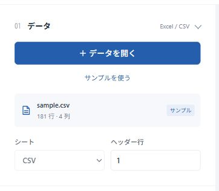
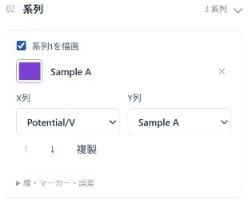
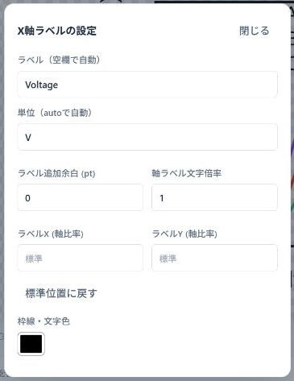
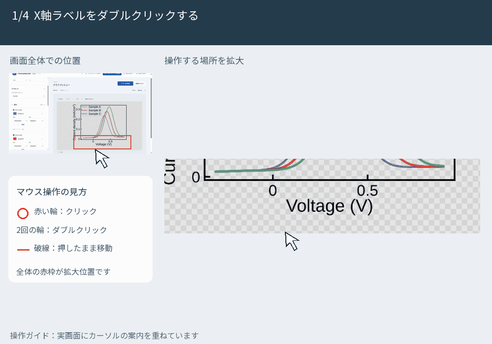
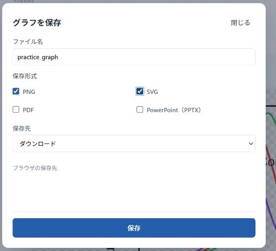

# PlotLauncher 簡易マニュアル

ExcelやCSVの測定データから、レポートに貼るグラフを作ります。初めての方は、このページの順番で操作してください。

[PlotLauncherを開く](https://murajun620-crypto.github.io/plot_launcher_web/) ｜ [詳しい操作を見る](detailed.md)

## 1. データを開く

描画機能の準備が終わったら、左の「＋ データを開く」でExcelまたはCSVを選びます。練習には「サンプルを使う」を押してください。

**表は、列に項目、行に測定点を並べます。** 最初の行を見出しにすると、次のようになります。

| Potential/V | Sample A | Sample B |
| --- | --- | --- |
| -0.50 | 0.001 | 0.003 |
| -0.25 | 0.050 | 0.080 |
| 0.00 | 0.200 | 0.250 |

この例では、1列目が共通のX、2・3列目がそれぞれのYです。数値のセルには単位を付けず、単位は見出しや軸設定に書きます。

[練習用CSVをダウンロード](examples/shared_x.csv) ｜ [X・Yの組や見出し行の説明](detailed.md#2-データの構成)

## 2. プリセットと系列を選ぶ

1. 「グラフのプリセット」で、CV/LSV・Raman Spectrumなど、測定に合うものを選びます。
2. 「02 系列」の **X列・Y列** が正しいか確認します。
3. 曲線を増やすときは「系列を追加」を押します。

色の四角を押すと色パネルが開きます。「系列を描画」のチェックで、その曲線を表示・非表示にできます。凡例に表示する名前もここで入力します。

## 3. ラベルと注釈を整える

軸ラベルを **ダブルクリック** すると、ラベル・単位を編集できます。目盛りの数値やグラフの線も、ダブルクリックで設定が開きます。

軸ラベルと注釈はドラッグで移動できます。注釈は左の「テキストを追加」などで追加し、選択して「選択を削除」で消します。凡例のオン・オフは「注釈」の「凡例を表示」です。

GIFの赤い輪はクリック、2回の輪はダブルクリック、破線はドラッグを示します。画像とGIFはクリックすると拡大できます。

## 4. 完成図を保存する

1. 曲線・凡例・軸の単位を確認します。
2. 右上の「グラフを保存」を押します。
3. ファイル名・形式・保存先を選び、下の「保存」を押します。初めは **PNG** で大丈夫です。

「元ファイルと同じフォルダ」を使うとき、初回にフォルダ選択が出たら、元データの入ったフォルダを選びます。フォルダ選択に対応しないブラウザでは「ダウンロード」を使います。

貼り付けるだけなら「画像をコピー」→ WordやPowerPointで **Ctrl＋V**（Macは **Cmd＋V**）でも使えます。

## 5. プロジェクトも保存する

上部の **「プロジェクトを保存」** で、データと設定を `.plotproject` にまとめて保存します。次回は「プロジェクトを開く」で再開できます。

PNGを保存しても、編集を再開するためのプロジェクトは保存されません。**作業を終える前に、完成図とプロジェクトの両方を保存しましょう。**

詳しい設定や、表示がおかしいときの対処は [詳細マニュアル](detailed.md) を参照してください。
